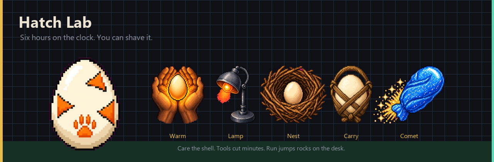
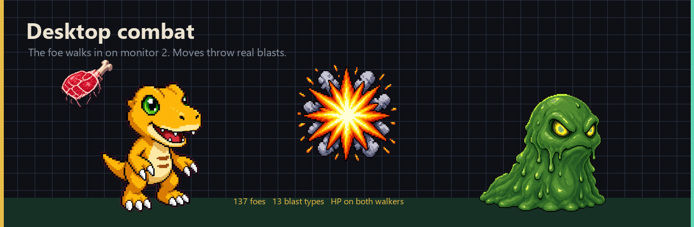
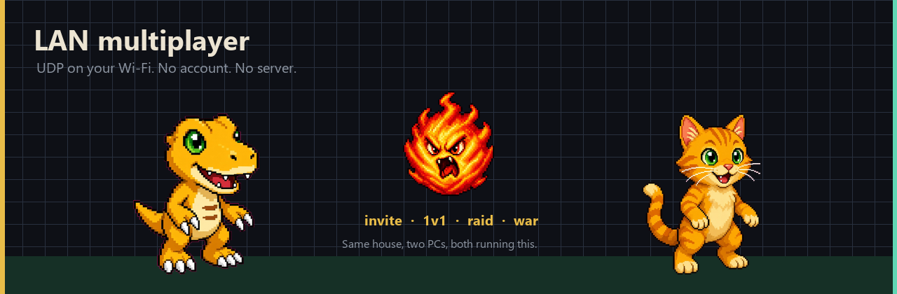

<p align="center">
  
</p>

<p align="center">
  <a href="https://github.com/rodryan542-cpu/PetFriendlyPC/releases/latest"></a>
  
  
  
</p>

# PetFriendlyPC

A Tamagotchi that **lives on monitor 2**. It walks the desk while you work. Fights happen as a second walker on that same screen — not a full-screen overlay. First partner is free. Everyone else is **$2,500,000**. Shop prices, hatch tools, and move upgrades get worse every time you buy them.

**Windows. Two monitors. That’s the whole pitch.**

<p align="center">
  
</p>

## Get it

1. Grab [**PetFriendlyPC-windows.zip**](https://github.com/rodryan542-cpu/PetFriendlyPC/releases/latest) from Releases.
2. Unzip. Keep the folder together. Run `PetFriendlyPC.exe`.
3. Point it at a second display. It parks there.

Saves as `state.json` next to the exe (or next to the scripts if you run from source).

From source, Python 3 + Pillow + numpy:

```
pythonw digimon_pet.py
```

## The pad

The pet walks alone. The **pad** stays put — drag it. MENU opens the house.

| Button | What it does |
| --- | --- |
| FEED / TRN / PLAY | Hunger, strength, mood. Cooldowns are real. |
| FIGHT | Wild scrap, dungeon, or raid. Eggs use RUN instead. |
| HATCH | Hatch Lab. Care, tools, desktop run. |
| SHOP | 50 bag items + 20 pieces of gear. |
| GO | Send them out. Money, snacks, sometimes an ambush. |
| BED / WASH | Sleep. Shower. They get dirty if you ignore hygiene. |
| SWAP | Page the 32 lines. You only *own* what you paid for. |

First boot you pick **one** line. That one is yours. The rest wait behind the $2.5M wall.

<p align="center">
  
</p>

32 partners across animals and fan faces (Digimon, Pokémon, Nintendo, and a pile of other tags). Stages are egg → baby → the thing you actually wanted. Wait times start at **6 hours** and go up. Strength, feeds, and trains also have to be there or the shell will not crack.

## Hatch Lab

Eggs are not a loading screen. They are the first roommate.

<p align="center">
  
</p>

**Care** — tap the shell. Catch the kick when the bar hits the green. Ten little actions (roll, talk, turn, listen, wish, look, pat, peek, rock, snack) with their own cooldowns. Warmth and kicks actually count.

**Tools** — ten of them. They delete real minutes off the clock, then sit on cooldown.

| Tool | Cuts | Notes |
| --- | --- | --- |
| Carry | 8 min | Free. Walk with it. |
| Warm | 12 min | Hands on the shell. |
| Lullaby | 14 min | Sing it along. |
| Pulse | 16 min | Jolt. A bit of strength too. |
| Spicy Rub | 18 min | Heat in the shell. |
| Heat Lamp | 28 min | Bake time off. |
| Rare Candy | 30 min | Fast cooldown, costs. |
| Incubate | 50 min | Lock it in. Long wait after. |
| Warm Nest | 70 min | Tuck it in. |
| Comet Chew | 90 min | Eat an hour and a half. |

Shop candies (`Rare Candy`, `Time Chew`) shave more from the bag. Gear with a hatch bonus (lantern, pack, sandals) makes tools cut harder.

**Run** — egg only. Rocks and birds slide across monitor 2 on the same floor the egg walks. Click the egg or press Space to jump. Three hits crack the shell. Distance still cuts hatch time. FIGHT on the pad leaves and cashes in. Hatched partners use RAID instead.

## Fights

The other guy walks onto monitor 2. You hit a move on the pad. A **blast** of that type flies in (fire, ice, water, shock, holy, dark, leaf, wind, slash, strike, gun, fruit, curse). Crits boom bigger. Misses sail past. The foe flashes, knocks back, and usually throws one back. Both walkers show HP.

<p align="center">
  
</p>

- **Wild** — one of 137 foes, typed to the line you picked. Weakness matters.
- **Dungeon** — five floors. HP carries. Clear for coins and XP.
- **Raid** — waves, then a boss. Up to four people on the LAN auto-hit with you.
- **Moves** — buy them in DOJO, equip **four**, upgrade them. Empty loadout is Struggle and it is sad.
- **Gear** — head / back / held / feet. Visors, wings, lanterns, toe claws. Every line can wear the same slots.

Shop meat is $500 after the grind multiplier. Deluxe steak, ramen, skill chips, smoke bombs — fifty bag items, all painted, all too expensive on purpose.

## Multiplayer (LAN)

No cloud. No login. Both PCs on the same network, both running PetFriendlyPC. It beacons over **UDP 47832**. Nearby names show up on TEAM.

<p align="center">
  
</p>

**Clan** — MAKE a clan (name + crest + a join code) or JOIN with that code. INVITE whoever is nearby. Leave if you want. Wins and losses stick on the clan.

**Chat** — WRITE on TEAM. Short messages to everyone close.

**1v1** — FIGHT on a nearby player. They get YES / NO on the pad. Moves go over the LAN.

**War** — two clans, power vs power, one seed, one result.

**Raid queue** — queue up, someone hits start, up to four of you share the boss. Allies keep hitting while you pick moves.

If Windows Firewall asks, allow it on private LAN. It is not talking to the internet.

## Why the grind

`LINE_PRICE` is 2,500,000. Shop costs are ×50. Move upgrades grow 2.4× per level. That is not a bug. The desk pet is the toy. The wall is the game.

Quests on the LCD pay a little. GO pays a little. Wins pay a little. Then you buy meat again.

## Fan faces

The famous ones belong to their companies. This is a fan toy for a messy dual-monitor desk, not an official anything.

## Build from source

```
pip install pillow numpy pyinstaller
pythonw digimon_pet.py
```

Exe:

```
pyinstaller --noconfirm --clean --windowed --name PetFriendlyPC --add-data "sprites;sprites" --add-data "ui;ui" digimon_pet.py
```

Output: `dist/PetFriendlyPC/PetFriendlyPC.exe` (the whole folder, not just the exe).

MIT. Made for the monitor you were not using.
