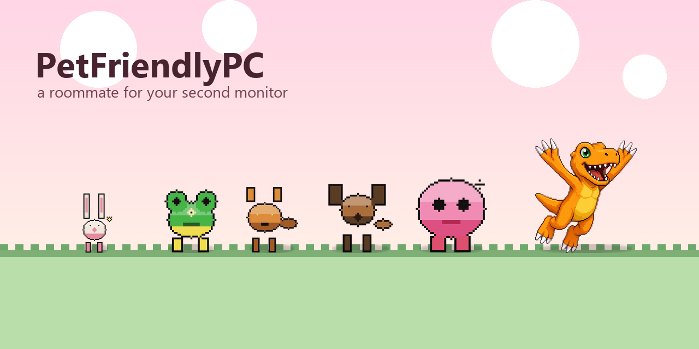
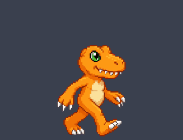
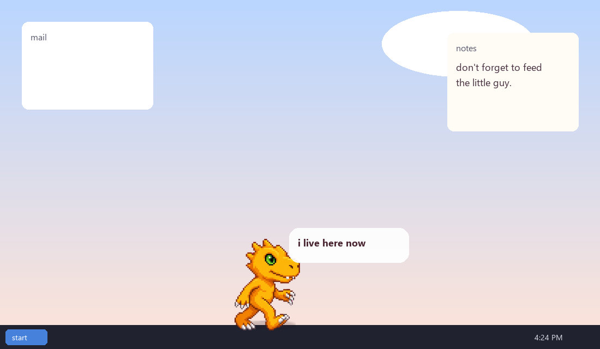
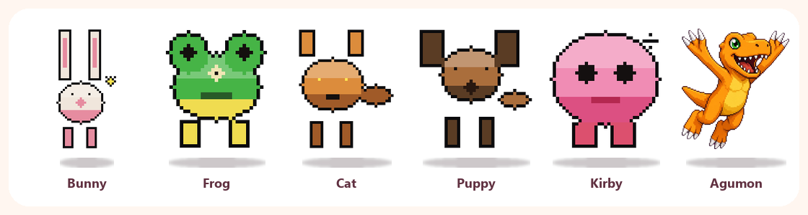

<p align="center">
  
</p>

# PetFriendlyPC

A Windows desktop pet. It lives on your **second monitor** and walks around while you do other stuff.

<p align="center">
  
</p>

## Why it exists

Second screens are usually a wallpaper and a Discord window. This puts someone there.

It is a Tamagotchi that sits on the desk, not a game you alt-tab into. Feed it. Let it sleep. Watch it get dirty. When a fight starts, the other guy also walks on that same monitor — no giant overlay covering your work.

You pick **one** partner on first boot. Everyone else is **$2,500,000**. Shop stuff, hatch tools, and move upgrades get more expensive every time you buy them. The grind is the point.

<p align="center">
  
</p>

## Who can move in

32 lines. Animals (bunny, frog, cat, dog, fox, owl) plus fan pixel pets — Digimon, Pokémon, One Piece, and a pile of other game faces.

First one is free. The rest you earn.

<p align="center">
  
</p>

## Run it

Windows. Two monitors. It parks on monitor 2.

**Exe** (after a build): `dist/PetFriendlyPC/PetFriendlyPC.exe`

**From source** (Python 3 + Pillow + numpy):

```
pythonw digimon_pet.py
```

Save data is `state.json` next to the exe, or next to the scripts if you run from source.

## Fan characters

Those famous faces belong to their companies. This is a fan toy, not an official anything.

## Build the exe

```
pip install pyinstaller pillow numpy
pyinstaller --noconfirm --clean --windowed --name PetFriendlyPC --add-data "sprites;sprites" --add-data "ui;ui" digimon_pet.py
```

MIT license. Made for a messy dual-monitor desk.
